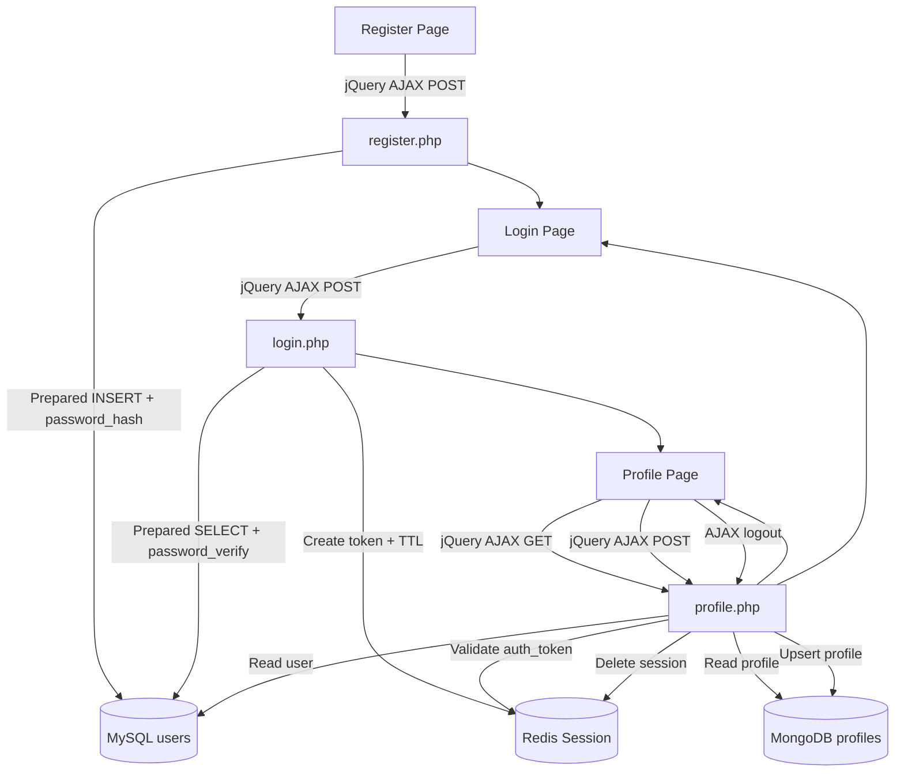

# Application Flow

```mermaid
flowchart TD
    A[Register Page] -->|jQuery AJAX POST| B[register.php]
    B -->|Prepared INSERT + password_hash| C[(MySQL users)]
    B --> D[Login Page]

    D -->|jQuery AJAX POST| E[login.php]
    E -->|Prepared SELECT + password_verify| C
    E -->|Create token + TTL| F[(Redis Session)]
    E --> G[Profile Page]

    G -->|jQuery AJAX GET| H[profile.php]
    H -->|Validate auth_token| F
    H -->|Read user| C
    H -->|Read profile| I[(MongoDB profiles)]
    H --> G

    G -->|jQuery AJAX POST| H
    H -->|Upsert profile| I

    G -->|AJAX logout| H
    H -->|Delete session| F
    H --> D
```
