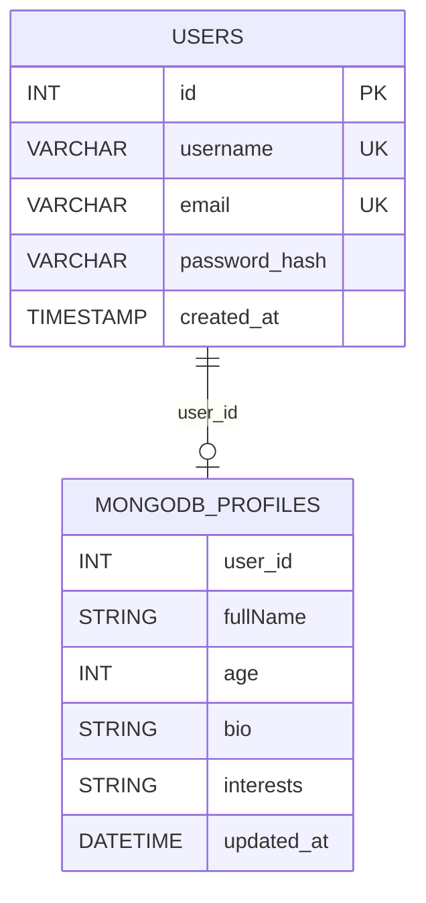

# Database Schema

## MySQL

The `users` table stores authentication data:
- `username`
- `email`
- `password_hash`
- timestamps

## MongoDB

The `profiles` collection stores additional profile information:
- `user_id`
- `fullName`
- `age`
- `bio`
- `interests`
- `updated_at`

Redis stores the login session temporarily using a SHA-256-derived session key.
